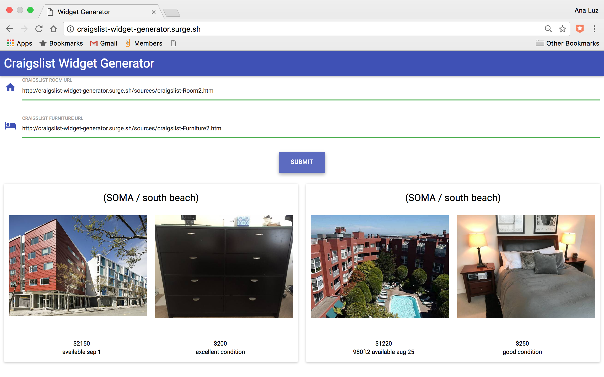

# Craigslist Web Page Scraper and Widget Generator

# Technology
Most of the code is written in JavaScript. There is a very simple static HTML skeleton, and the rest of the HTML is generated dynamically using JavaScript. All HTTP requests/AJAX calls were done using the fetch API. The HTML parsing was done with the DOMParser and the data was extracted using DOM query methods. Elementx library was used to create all HTML/DOM elements. Any CSS is done using Materialize and optimized for various viewport sizes. Lastly, Surge was used to deploy to a production environment: [craigslist-widget-generator](http://craigslist-widget-generator.surge.sh/)

Here are some sample inputs to test if you'd like to generate a widget yourself:

Room url input-> http://craigslist-widget-generator.surge.sh/sources/craigslist-Room1.htm

Furniture url input-> http://craigslist-widget-generator.surge.sh/sources/craigslist-Furniture1.htm

# Product Inspiration
People are often stressed out when they have to move, especially when they have to relocate from other states or countries. Some of these concerns include finding the right apartment and a bed where they can sleep on upon arrival. Unless they have friends in the area, people relocating have an additional disadvantage of not knowing about the most secure places to live while still being in close proximity to work, public transit, grocery stores, etc.

# Product Features
The idea behind the widgets generated is to be able to show recommended listings for both rooms and furniture in the same neighborhood to make the transition easier. Some short-term improvements include incorporating information about the safety of the neighborhood, school districts, as well as walkability and public transit scores. Some long-term improvements include optimizing the end-to-end experience of the user during relocation which could include scheduling an airport pick up with say Lyft or Uber, and delighting the user with their room already furnished upon arrival with the help of moving services like Lugg.
